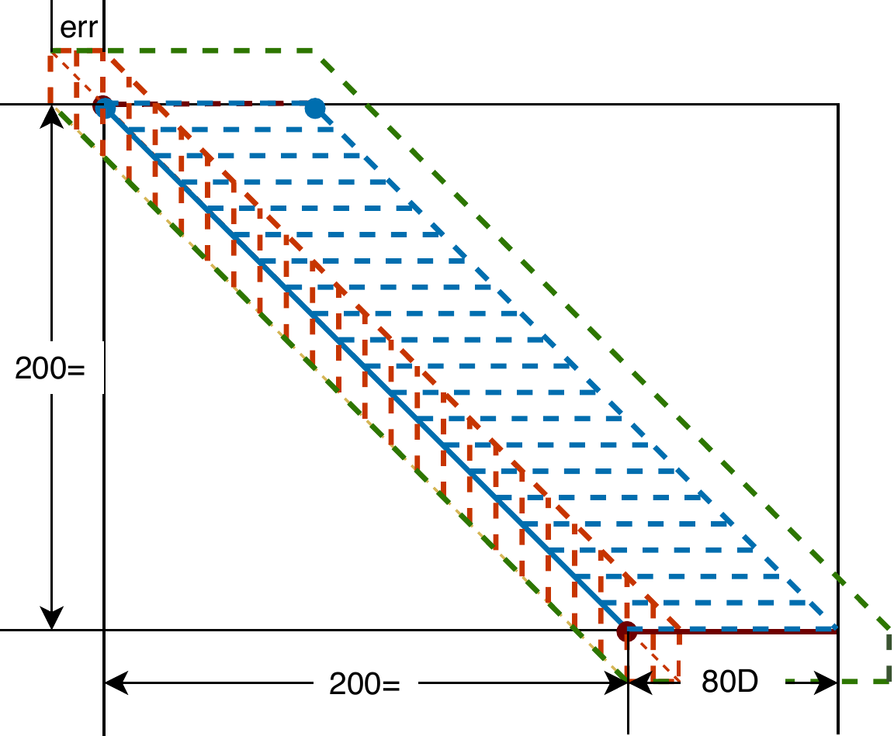

<h1 align="center"></h1>

***

## alignment-free methods 
Mapping reads efficiently. 

## Prerequisites

| Building tools  |   Version          |
| ------------------- | ------------------------- |
| Linux| >4.9.0|
| GCC|>4.9|
| CMAKE|>3.0.0|


### External libraries used in the source

- [SeqAn 2.0](<https://seqan.readthedocs.io/en/master/>)-Generci library for sequence analysis

- [googletest](<https://github.com/google/googletest>)-Unit test

- [skasort](https://github.com/skarupke/ska_sort)-A consice library of sorting algorithms

### Pre-install required
- [zlib](<https://www.zlib.net/>)-(File compression I/O).
  To install on Ubuntu based distributions:
```bash
$sudo apt install zlib1g-dev libbz2-dev
```

## Build
Create a new build directory. In the build directory
```bash
$CMake [path to git cloned source] 
$make linear 
```

## Usage
Support .fa(.gz), .fastq(.gz) for input.
```bash
$linear read.fa genome.fa
``` 
Please add 'x' when mapping more than one reads and genomes.
```bash
$linear *fa x *fa
``` 
Use -h for more details regarding options
```bash
$linear -h
```

## File format of results
### SAM/BAM
Standard format for alignment and map.
The definition of SAM/BAM of alignment of Linear is identical to the standard.
The definition of SAM/BAM of map of Linear is changed as the following table.


|col |filed|Description|Status|
|--|--|--|--|
|   1  | QNAME | Query template NAME                       | Yes       |           
|   2  | FLAG  | bitwise FLAG                              | Yes       | 
|   3  | RNAME | Reference sequence NAME                   | Yes       | 
|   4  | POS   | 1-based leftmost mapping POSition         | Yes       | 
|   5  | MAPQ  | MAPping Quality                           | Yes       | 
|   6  | CIGAR | CIGAR string                              | Changed   | 
|   7  | RNEXT | Reference name of the mate/next read      | Yes       |
|   8  | PNEXT | Position of the mate/next read            | Yes       |
|   9  | TLEN  | observed Template LENgth                  | Yes       | 
|   10 | SEQ   | segment SEQuence                          | Changed   |
|   11 | QUAL  | ASCII of Phred-scaled base QUALity+33     | Yes       |
|   12 | TAG   | Optional tags                             | Changed   |

- 6th column of cigar is changed in the SAM/BAM of map.
Standard cigar of denotes the alignment of bases, while cigar of map here extends segments in the alignment matrix to region.
Specially, cigar of map in Linear is in the format of 'MG', where 'M' is allowed to be 'X' and '=' of standard cigar while 'G' is allowed to be 'I' and 'D' of standard cigar.
An example of '200=80D' with the corresponding region is shown in the following figure, where the green region is the region of the cigar, where the alignment is supposed to be.


- 10th column of SEQ is inferred according to the reference and the 4,6th column rather than segment of read.
For cigar operation '=', the corresponding base from the reference rather than the read is inserted into the SEQ.
Thus the operation of '=' in result of mapping doesn't necessarily mean the read is identical to the reference at the level of base pairs.
This is different from the SEQ for alignment.
The change of definitation is to make the SEQ of mapping compatible to existing tools
For operations of 'M', 'X', 'I', and 'S' the corresponding bases in the read are inserted.
This is identical to the SEQ for alignment.

- 12th column, in which the definition of 'SA:Z' is changed because of the change of 6th and 10th columns.
Other tags are identical to the standard.
Standard definition of the tag can be found at [SAM/BAM format](https://samtools.github.io/hts-specs/SAMv1.pdf) and [Optional tags](https://samtools.github.io/hts-specs/SAMtags.pdf)

### Approximate mapping file (.apf)
This is the nonstandard format extended of map to provide readable overview of the result of map.
The file can be enabled/disabled with the option '-ot'.
The apf of one read contain the header and record
The following are the definition of the header and record.
|col |filed|Description|Type|
|--|--|--|--|
|1|@|sign to start the header|{'@'}|
|2| QNAME|Query template NAME|string|
|3| QLEN|Query template LENGTH|int|
|4| QSTR|Query template mapped START| int |
|5| QEND|Query template mapped END| int |
|5| QSTRD|Query template mapped main STRAND|{'+','-'}|
|6| RNAME | Reference sequence NAME|String| 
|6| RLEN | Reference sequence LENGTH|int| 
|7| RSTR | Reference sequence mapped START|int| 
|8| REND | Reference sequence mapped END|int| 

|col |filed|Description|Type|
|--|--|--|--|
|1|\||sign to start record|string|
|2|QSTR|Query region start|int|
|3|RSTR|Reference region start|int|
|4|DY|Distance of current 3th col to last|int|
|5|DX|Distance of current 4th col to last|int|
|6|RSTRD|region strand|{'+','-'}|

Following is an example of the apf the read mapped to the reference.
```
@> S1_14253 10049 45 10049 + chr1 44948 9964 19212 
| 45 9964 0 0 1 - 
| 215 10119 170 155 2 -
| 352 10240 137 121 3 -
| 446 10327 94 87 4 - 
...
| 6656 16080 144 128 48 - 
| 6800 16208 144 128 49 - 
| 6944 16336 144 128 50 - 
| 1931 16507 -5013 171 51 + 
| 2126 16690 195 183 52 + 
| 2309 16857 183 167 53 + 
| 2462 16999 153 142 54 + 
| 2592 17120 130 121 55 + 
| 2674 17189 82 69 56 + 
...
| 9680 18839 0 7 68 - 
| 9870 19020 190 181 69 -
```
[sam]()-sam file
[gvf]()

## Adaption to existing pipelines
The result of alignment is supposed to be called existing pipelines as many other aligners.
Besides, the result of map (with the alignment completely disbaled) can be called by existing alignment based pipelines, such as the SVs caller.

### Adapation to SVs callers
The compatibility of the result of map to the SVs caller [PBSV](https://github.com/PacificBiosciences/pbsv) has been tested with PacBio long reads.
It's worth to note the latest version (< 2.6.2) of PBSV takes nonstandard BAM whose delimitor of header is 'space' rather than 'tab'.
To output bam compatible to PBSV, run with option <b>-sn 1 -rg 1-ot 8</b> enabled in Linear, or enable option <b>-s 1</b> in the PBSV.
### Adaption to seqeunce graphical tools (IGV)
The compatibility of the result of map to the IGV has been tested.
.bam of map can be callerd directly.


## license
BSD License 2.0


## Contact


