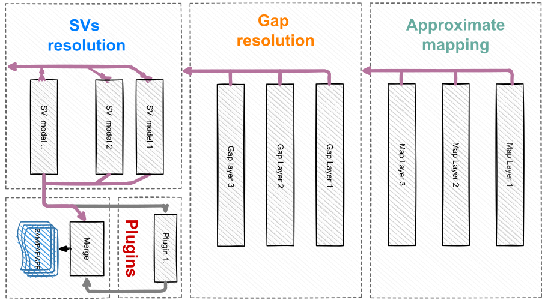

Linear: ALIgNment-freE method for long-read vARiants resolution 
====

[](https://opensource.org/licenses/BSD-3-Clause)


Linear is an alignment-free framework for resolving structural variants in long reads. 
Existing pipelines for variants in long reads are commonly based on alignment. 
Fundamental models of alignment plays an essential role in identifying novel structures.
However forced alignment of complex structures remain the problems.
Besides, inflexibility to extend models for diverse structures and computational inefficiency are problems of alignment-based pipelines as well.
Thus we develop Linear to enable alignment-free methods for resolving variants in long reads. 
Compared to the alignment, it's easier to adopt effective and efficient models within the alignment-free framework.
Linear is composed of different layers of models (in the figure), which can be extended or replaced.
The result of Linear is based on SAM/BAM.
Hence it can be called directly by alignment-based tools such as samtools, SVs caller PBSV and visualization tool IGV.

<p align="center">
 
</p>

## Build and usage 
### Prerequisites
Please make sure the following systems have been installed before building from the source.
||requirement|version|comment|
|--|--|--|--|
|**Compiler**|[GNU/Linux GCC](https://gcc.gnu.org/) | ≥ 4.9.0|no other compiler is currently supported|
|**Build system**| [CMAKE](https://cmake.org/) |≥ 3.0.0|/|
|**External libs**|[zlib](https://github.com/madler/zlib)|≥ 1.2|required for `*.gz` and `*.bam` file support |


```bash
#To install cmake, zlib for Debian, Ubuntu, etc.
sudo apt-get install cmake
sudo apt-get install zlib1g zlib1g-dev

#To install cmake, zlib for RedHat, Fedora, etc.
sudo dnf install cmake 
sudo dnf install zlib-devel  
```

### Build
```bash
#To build from source, please type in the commandline
mkdir -p build/release && cd $_ 
CMake [path to source] 
make linear -j 4 #use 4 threads to compile
```

### Usage
```bash
#Sequence format .fa(stq)(.gz) are supported for input.
linear read.fa(stq)(.gz) genome.fa(.gz)
#Please add argument x between the reads and 
#references for more than 2 inputs. 
linear *.fastq x *.fa
Linear: ALIgNment-freE method for long-read vARiants resolution
--Read genomes                                     
  File: all.fa.gz [24 sequences; 2945 mbases; Elapsed time[s] 19.75 100%]
--Index::Initiate[100%]   
  Index::Hash    [100%]              
  End creating index Elapsed time[s] 22
--SRR9001768.fa
  I/O::in :273300        cpu:32.70[s]    speed:8358.11[rds/thd/s]
  I/O::out:270400        cpu:135.54[s]   speed:1995.00[rds/thd/s]
  Compute:273000 cpu:472.13[s] speed:1578.24[rds/thd/s]
  Processed:270400 time:138.27[s] speed:1955.62[rds/s]

``` 
```bash
#Please use -h for more details of options
linear -h
Linear - options and arguments.                          
====================================                          
SYNOPSIS                                  
    Linear [OPTIONS] read.fa/fastq(.gz) genome.fa(.gz)                             
DESCRIPTION                                 
    -h, --help                                   
          Display this help message.                               
    --version                                     
          Display version information.            
  Basic options:                              
    -o, --output STR                          
          Set the path of output. Linear will use the prefix of the reads filename for output if the this option is
          empty
    -ot, --output_type INT
          Set the format of output file. 1 to enable .APF, an approximate mapping file for non-standard application; 2
          to enable .SAM; 4 to enable .BAM; Set values 3 {DEFAULT 3=1+2} to enable both .apf and .sam
    -t, --thread INT
          Set the number of threads to run -t 4 {DEFAULT}
    -g, --gap_len INT
          Set the minimal length of gaps. -g 50 {DEFAULT}. -g 0 to turn off mapping of gaps.
    -rg, --read_group STR
          Set the name of read group specified in the SAM header
    -sn, --sample_name STR
          Set the name of sample specified in the SAM header

  More optoins (tweak):
    -b, --bal_flag INT
          Set to Enable/Disable dynamic balancing tasks schedule. -b 1(Enable) {DEFAULT}
    -p, --preset INT
          Set preset of parms. -p 0 {DEFAULT} -p 1 efficient -p 2 additional
    -i, --index_type INT
          Choose the type of indices{1, 2}. -i 1 {DEFAULT}
    -c, --apx_c_flag INT
          0 to turn off apx c mapping
    -f, --feature_type INT
          Set types of features {1,2}. -f 2 (2-mer, 48bases){DEFAULT}
    -r, --reform_ccs_cigar_flag INT
          Enable/Disable compressing the cigar string for Pacbio CCS reads. -r 0(Disable) {DEFAULT}

```


## Adaptation to existing pipelines

### Adaptation to Samtools
Compatibility  with Samtools 1.10 has been test. 
Alignment-free results can work with 'samtools view', 'samtools index' and 'samtools sort' to convert and index SAM/BAM file.

### Adaptation to SVs callers
Compatibility of with the SVs caller [PBSV](https://github.com/PacificBiosciences/pbsv) 2.6.2 has been tested with PacBio raw reads and CCS reads. 
SAM/BAM from Linear can work with 'PBSV discover' and 'PBSV call' provided the sample and group name is set appropriately with the -s option in pbsv discover.

### Adaptation to seqeunce graphical tools (IGV)
Compatibility with the IGV 2.8.3 has been tested. 
Please apply samtools to convert and index the sam file by Linear to bam.
Indexed alignment-free bam file can be visualised directly in the IGV.

## Updating variant models 
Models for SVs in Linear are flexible to extend.
We would continuously adopting more effective models for novel structural variants.
This would improve the performance of Linear.
However it would lead to different results between versions as well.

## Format of alignment-free results 
### SAM/BAM
The output of Linear is converted to the SAM/BAM format for alignment-free result.
The format is based on the standard SAM/BAM format and extended for alignment-free result.
It's compatible with the alignment.
3 fields in the standard format are redfined while others fields remain:
- The 6th column of cigar is redefined in the extended SAM/BAM.
Alignment-free cigar denotes the virtual alignment between 2 points, which is always in the pair of 'MG', where 'M' is 'X' or '=' and 'G' is 'I' and 'D'.
- The 10th column of SEQ is subsequence from read or reference.
- The 12th column of the tag 'SA:Z' is redefined.
Other tags are identical to the standard tag, which can be found at [SAM/BAM format](https://samtools.github.io/hts-specs/SAMv1.pdf) and [Optional tags](https://samtools.github.io/hts-specs/SAMtags.pdf).


### Alignment-free mapping file (APF) 
The outputs contain an .apf file by default.
APF is a nonstandard format based on the [PAF](https://github.com/lh3/miniasm/blob/master/PAF.md).
The format is being improved to provide readable alignment-free results.
The APF format contains the header(H) and records(R) defined in the following table.
The output for APF  can be disabled by the option '-ot 2'.
|col(H/R) |filed|Description|Type|
|--|--|--|--|
|H1|@|sign of header|{'@'}|
|H2| QNAME|Query template NAME|string|
|H3| QLEN|Query template LENGTH|int|
|H4| QSTR|Query template mapped START| int |
|H5| QEND|Query template mapped END| int |
|H7| QSTRD|Query template mapped main STRAND|{'+','-'}|
|H7| RNAME | Reference sequence NAME|String| 
|H8| RLEN | Reference sequence LENGTH|int| 
|H9| RSTR | Reference sequence mapped START|int| 
|H10| REND | Reference sequence mapped END|int| 
|R1|RSGN|sign to start record|{'\|'}|
|R2|QSTR|Query template mapped base|int|
|R3|RSTR|Reference sequence mapped base|int|
|R4|DY|Distance of R3  to last R3|int|
|R5|DX|Distance of R4  to last R4|int|
|R6|RSTRD|record strand|{'+','-'}|
