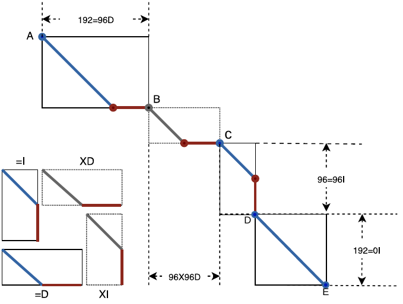

Linear: ALIgNment-freE framework for long-read vARiants resolution
====

[](https://opensource.org/licenses/BSD-3-Clause)


Linear is a framework integrating long-read workflows distinct from assembly- and alignment-based ones.
It aims for developing effective and efficient long-read algorithms.
Linear is designed to be compatible with existing software including but not limited to samtools, SVs callers, and visualization tools.

## Build and usage
### Prerequisites
Please make sure the following systems have been installed before building from the source.
- GNU/Linux GCC ≥ 4.9.0
- CMAKE ≥ 3.0.0
- zlib ≥ 1.2


```bash
#To install prerequisites for Debian, Ubuntu, etc.
sudo apt-get install cmake
sudo apt-get install zlib1g zlib1g-dev

#To install prerequisites for RedHat, Fedora, etc.
sudo dnf install cmake
sudo dnf install zlib-devel

#To install cmake prerequisites for Arch, manjaro,etc.
#zlib-dev is not needed
sudo pacman -S cmake
```

### Build from source
```bash
#To build from source, please type in the commandline
mkdir -p build/release && cd $_
CMake [path to source]
make linear -j4 #use 4 threads to compile
```
### Generic usage
```bash
# Specify modules in Linear
linear module [options]
```
```bash
# Check generic help for available modules
linear -h
Linear - options and arguments.
====================================

SYNOPSIS
    Linear <submodules> -h for help

DESCRIPTION
    -h, --help
          Display this help message.
    --version
          Display version information.

AVAILABLE SUBMODULES:
    filter: The submodule is to detect SVs signals hidden in long reads.
          It takes input as long reads and outputs SAM/BAM. Type "linear filter -h" for more info.

```


## Submodules
### 1.Filter
The filter (pipeline B in the figure) is an ultra-fast SVs filter for population-scale long-read SVs detection.
It is built on generative models, which are very effective in detecting SVs embedded in long reads.
The filter outputs SAM/BAM*, which is compatible with alignment-based software.

<p align="center">

</p>

#### Filter usage
```bash
#Example 1: Sequence format .fa(stq)(.gz) are supported for input.
linear filter read.fa(stq)(.gz) genome.fa(.gz)
#Following is the status when running the filter
Linear: ALIgNment-free methods for long-read vARiants resolution
--Read genomes
  File: all.fa.gz [24 sequences; 2945 mbases; Elapsed time[s] 19.75 100%]
--Index::Initiate[100%]
  Index::Hash    [100%]
  End creating index Elapsed time[s] 22
--SRR9001768.fa
  I/O::in :273300        cpu:32.70[s]    speed:8358.11[rds/thd/s]
  I/O::out:270400        cpu:135.54[s]   speed:1995.00[rds/thd/s]
  Compute:273000 cpu:472.13[s] speed:1578.24[rds/thd/s]
  Processed:270400 time:138.27[s] speed:1955.62[rds/s]
```
```bash
#Example 2: Argument x between the reads and references for more than 2 inputs.
linear filter *.fa(stq)(.gz) x *.fa(.gz)
```
```bash
#Example 3: For options help
Linear filter -h

Linear filter - options and arguments.
===========================================

SYNOPSIS
    Linear filter [OPTIONS] read.fa/fastq(.gz) genome.fa(.gz)

DESCRIPTION
    -h, --help
          Display this help message.
    --version
          Display version information.

  Basic options:
    -o, --output STR
          Set the prefix of output. The filter will use the prefix of the filename of reads as the prefix of output if
          the option isn't set
    -ot, --output_type INT
          Set the format of the output file. 1 to enable .APF, an approximate map file for non-standard application; 2 to
          enable .SAM {DEFAULT}; 4 to enable .BAM; Set values 3 (3=1+2) to enable both .apf and .sam
    -t, --thread INT
          Set the number of threads to run. -t 4 {DEFAULT}
    -g, --gap_len INT
          Set the minimal length of gaps. -g 50 {DEFAULT}. -g 0 to turn off map of gaps.
    -rg, --read_group STR
          Set the name of the read group specified in the SAM header
    -sn, --sample_name STR
          Set the name of the sample specified in the SAM header

  More options (tweak):
    -dup, --duplication INT
          Redetect duplications for signals of insertions. Enabling (-dup 1) this option will treat many insertions as
          duplications. This option is off (-dup 0) {DEFAULT}
    -b, --bal_flag INT
          Set to Enable/Disable dynamic balancing tasks schedule. -b 1(Enable) {DEFAULT}
    -p, --preset INT
          Set predefined sets of parameters. -p 0 {DEFAULT} -p 1 efficient -p 2 additional
    -i, --index_type INT
          Choose the type of indices{1, 2}. -i 1 {DEFAULT}
    -c, --apx_c_flag INT
          0 to turn off apx map
    -f, --feature_type INT
          Set types of features {1,2}. -f 2 (2-mer, 48bases){DEFAULT}
    -r, --reform_ccs_cigar_flag INT
          Enable/Disable compressing the cigar string for Pacbio CCS reads. -r 0(Disable) {DEFAULT}
```
### Adaption to software
#### samtools


Compatibility with samtools 1.10 has been tested.
Results of the filter are compatible with 'samtools view', 'samtools index' and 'samtools sort'.

#### PBSV


PBSV is a SVs caller for PacBio long reads. Compatibility with PBSV has been tested.
Set the sample and group name appropriately with option -s when using pbsv discover.

#### SVIM


SVIM is an SVs caller for PacBio and ONT reads.
SVIM takes as input the SAM/BAM.
The compatibility of the filter with SVIM has been tested.
And results of the filter can be processed directly by SVIM with default settings.

#### cuteSV


cuteSV is an SVs caller for PacBio and ONT reads.
cuteSV takes as input the SAM/BAM.
The compatibility of the filter with cuteSV has been tested.
And results of the filter can be processed directly by cuteSV with default settings.

#### IGV


IGV is a sequencing visualization tool. Compatibility with IGV has been tested.
Please use samtools to convert and index the results of filter before using IGV.
The indexed BAM* can be visualized directly by IGV.

## File format
### SAM/BAM*
The SAM/BAM* is an extension of standard SAM/BAM to express the virtual alignment between a series of given points.
We defined 4 basic types of virtual alignment in SAM/BAM*.
The figure shows an example to designate the virtual alignment of 5 given points A−E by using the 4 basic types whose cigars are =I, =D, XI, and XD.
<p align="center">

</p>
SAM/BAM* is identical to the standard SAM/BAM when the distance between the given points is constant 1.
Thus SAM/BAM* is a superset of the standard SAM/BAM.
And exact alignment in the format of SAM/BAM* is identical to that in the format of the standard one.

3 fields in the standard format are redefined and other fields remain the same:
- The 6th column, cigar (denoted by cigar*), is redefined.
cigar* denotes the virtual alignment between 2 points, which is always in the pair of 'MG', where 'M' is 'X' or '=' and 'G' is 'I' and 'D'.
- The 10th column, SEQ*, is subsequence from read or reference.
- The 12th column, tag* 'SA:Z', is redefined.
Other tags are identical to the standard tag, which can be found at [SAM/BAM format](https://samtools.github.io/hts-specs/SAMv1.pdf) and [Optional tags](https://samtools.github.io/hts-specs/SAMtags.pdf).

```bash
#An example of records in SAM/BAM*.
#SEQs are generated according to cigars rather than segments of read.
#Bases in SEQs corresponding to ’49S’ are from read;
#Bases in SEQs corresponding to ’6=’  are from genome;
#Bases in SEQs corresponding to '1I'  are from read;
#Bases in SEQs corresponding to ’35X’ are from read.
#     if the base is unequal to the corresponding base in the genome,
#     otherwise the ’N’ is inserted.
#SA:Z tag is generated according to the cigars and SEQs.

@HD VN:1.6
@SQ SN:chr10 LN:135534747
@PG PN:Linear
@RG ID:1 SM:1
m140612_082500_42156_c100652082550000001823118110071461_s1_p0/104454/5061_10840
0 chr10 59256034 255 49S6=1I34=1I31=5I30=1I110=2I1=1I49=3I11=2I49=1I6=4I44=2I74
=16I1=1I51=17I96=35X26I66=5I40=3I70=2I101=5319S * 0 0 TAGCATAAGCTCTTTAGTTTAATTAG
ATCAGACATTTGTCAATGTTTGTGTCAATGGTTGGCTTTTGTTGCCTTTGCTTTTAGTGTTTTAAGTCATGAAGTCTTTG
...CCACTTGTGTAGAGAGGATGTGGAGAAAAAGAAATGCTTTTACACAGTTGGTGGGAGTGTAAATTCGTTCAACCACT
GTAGAAGACAGTGTTGTGATTCCTCAAGACACACNNNTTTTNCGCNNNTTTAANNNCTTTGNAGAACCCAACAATTAATA
...AGCTGGAAACCATCATTCTCAGCAAACTAACACAGGAACAGAAAACCAAACAC * SA:Z:chr10,59257622,-
,4379S320M5I4884S,255,27;chr10,59257982,+,1371S3138M338I146S,255,528;
```

## Updating
As a new type of pipeline for resolving long-read SVs, Linear will be steadily improved.
Unlike conventional workflows, Linear applies models which are flexible to extend.
There will be differences in performance as more and more models are extended while computational efficiency and effectiveness will always be the priorities.


